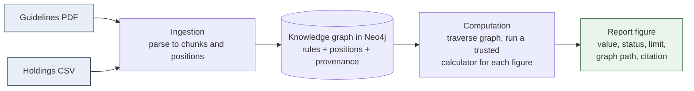
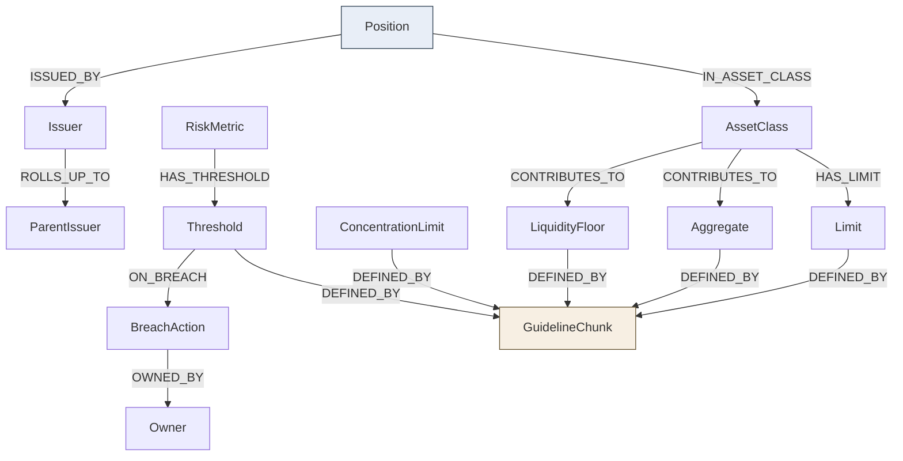

# RuleGraph Engine

RuleGraph produces an audit-grade portfolio compliance report for a fixed income fund. Given a fund
guidelines document and a period-end holdings snapshot, it computes every reported figure (asset
allocations, exposure caps, concentration limits, liquidity ratio, portfolio duration and DV01),
states whether each figure is inside or outside its limit, and shows exactly where every number came
from. The goal is not just correct numbers, but numbers a regulator or auditor can defend: each one
is reproducible, traceable back to the source passage that justifies it, and provably produced by
the calculation engine rather than by a language model.

This repository contains the backend engine. It is built with Java 21 and Spring Boot, stores the
knowledge graph in Neo4j, and uses Apache PDFBox and Commons CSV to read the source materials.

The design documents are under `docs/`: the process flows and audit event catalogue
([docs/01_flow_and_audit_events.md](docs/01_flow_and_audit_events.md)), the architecture
([docs/02_architecture.md](docs/02_architecture.md)), and the design memo
([docs/03_rfc.md](docs/03_rfc.md)).

## The problem this solves

A fund administrator runs a portfolio against a book of rules and must periodically report, for each
rule, whether the portfolio complies. Today this is done by hand in a spreadsheet. It is slow, easy
to get subtly wrong, and very hard to defend in an audit. When an examiner points at a number and
asks "where did this come from, and who computed it?", the honest answer is often a formula buried
deep in a working file.

RuleGraph replaces that manual process with a system designed around five hard requirements:

1. Reproducibility. Running the system twice on the same inputs yields identical figures.
2. Traceability. Every figure can be followed back to the exact source passage it was derived from,
   along an explicit path through the knowledge graph.
3. No model-generated numbers. A language model may write narrative commentary, but it must never be
   the source of any reported figure. This has to be verifiable, not merely promised.
4. Reconciliation. The output must match a firm's expected answer key exactly, or within a clearly
   stated tolerance.
5. Reconfiguration. A second firm that computes some figures differently must be supported by
   configuration only, with no change to the engine code.

The sections below explain how the design meets each of these.

## Why a knowledge graph, and why Neo4j

The rules in a fund's guidelines are not a flat list. They are a web of relationships. A limit
belongs to an asset class. An asset class contributes to an aggregate exposure cap. A risk metric
has a threshold, the threshold has a breach action, and the breach action has an owner who must be
notified. An issuer rolls up to a parent issuer, and concentration can be measured at either level.
A position belongs to an asset class and is tied to an issuer. Every one of these rules traces back
to a specific passage in the source document.

The reporting requirement is essentially a traversal over that web. To produce the
non-investment-grade figure, you start at two asset classes, follow them to the aggregate they feed,
read the cap off the aggregate, and follow the aggregate back to the passage that defines it. To
answer "who is notified if duration breaches its limit", you walk from the metric to its threshold to
the breach action to the owner. Storing this in a relational schema would mean a join table for each
relationship and a multi-way join for each question, and the all-important "where did this come from"
trail would be metadata bolted onto the side. In a graph it is the natural shape of the data, and the
trail is just another edge.

This is why the assignment calls for a knowledge graph, and why traceability has to be expressed as a
path through it rather than as a separate audit note. A graph makes the chain from a figure to its
source an explicit, walkable route instead of a claim recorded elsewhere.

Neo4j fits this for a few concrete reasons:

- It is a property graph, so relationships are first-class and can carry their own properties. That
  matters here because provenance (source document, page, chunk, ingestion time, extraction
  confidence) is attached to every edge as well as every node, which is what lets the citation travel
  with the relationship rather than being looked up separately.
- Cypher expresses multi-hop traversals directly. A question like "the breach action and owner for a
  metric" is a short, readable pattern, and the same traversal that answers a question is the one the
  computation layer uses to select a figure's inputs. The query is the explanation.
- It handles the variable-shape, heavily-interlinked structure of a rulebook comfortably, where a
  relational model would need many tables and the relationships would be implicit in foreign keys
  rather than explicit and queryable.
- The fund here is small, so this is not a choice driven by scale. It is driven by the shape of the
  problem and by traceability being a graph property. A well-modelled graph of this one fund, with a
  correct and fully traceable set of figures, is exactly what the task rewards.

## How the design meets the requirements

### Reproducibility

The path that produces a number contains no language model, no system clock, and no randomness. All
monetary and percentage arithmetic uses `BigDecimal` with explicit rounding, never floating point in
a reported value, and positions are summed in a stable order. As a result, two runs on the same
inputs produce byte-for-byte identical figures. This has been confirmed by diffing the JSON output
of two consecutive runs.

### Traceability through the graph

Figures are not computed from a hard-coded list of columns to add up. They are computed by traversing
the graph. For each figure the engine first asks the graph which positions contribute, which limit
applies, which calculation method to use, and which source passage defines the rule. Only then does
trusted code sum the relevant positions. Because the graph traversal is the mechanism that selects
the inputs, the path reported alongside the figure cannot drift away from how the figure was actually
computed. Each figure carries the graph path it travelled and a citation that ends at the specific
chunk of the guidelines document the rule came from. A figure that cannot be traced to a source is
returned as an error rather than emitted as a silent value.

### Keeping the language model out of the numbers

There is a strict separation between deterministic calculation and any model-assisted text. The model
is only allowed to do two things, and neither touches a number:

- During ingestion it interprets a passage of guideline prose into a structured rule description: the
  kind of rule, the entities involved, the threshold read from the text, and the name of a trusted
  calculation method. It names a method from a fixed list; it never defines one and never computes a
  result.
- During reporting (added in a later phase) it may write narrative commentary about figures that have
  already been computed.

This boundary is enforced structurally, not by instruction. The calculation layer has no dependency
on the model client and never receives the holdings data, so there is simply no code path from model
output to a reported number. Any calculation method named during extraction is validated against a
fixed registry; an unrecognised method is rejected rather than executed. On top of that, the system
verifies the boundary rather than just asserting it: after the narrative is generated, a firewall
check scans it for every numeric token and confirms each one already appears in the computed figures.
If the commentary ever introduced a number of its own, the check would flag it and the run would
report the violation. This makes the requirement observable, not merely promised.

### Reconciliation

The report computes thirteen figures for the sample fund and reconciles them against the firm's
answer key, reporting a pass or fail and a numeric delta for each. For Firm A the answer key is read
directly from the provided spreadsheet, so this is a genuine comparison rather than a check against a
transcription. All thirteen figures reconcile exactly on value, status, and limit utilisation, with a
delta of zero. Because net asset value is an exact figure and all arithmetic is decimal, no tolerance
is required.

### Reconfiguration to a second firm

A firm's house conventions are expressed as configuration that the shared calculators read at run
time, rather than as separate code branches. Each firm is a small YAML file describing three
settings: which holdings count toward the non-investment-grade aggregate, whether concentration is
measured per issuer or per parent group, and how utilisation is formatted. Selecting a firm at run
time loads that file and nothing in the engine changes.

This has been verified end to end. From a single build, running the report for Firm A and then for
Firm B produces both firms' answer keys, with all thirteen figures reconciling in each case. Firm B
differs in exactly the three ways its brief describes: a downgraded holding pulls the
non-investment-grade aggregate from fifteen percent to twenty-one percent and into breach; grouping
the two government-related issuers under their shared parent pushes that concentration from seven
percent to thirteen percent and into breach; and every utilisation is reported in truncated basis
points. Every other value and status is identical to Firm A. Adding a third firm would mean adding a
YAML file, not editing code.

## Architecture

The engine is a pipeline of clearly separated layers. Data flows in one direction, and the language
model sits on the outside of the numeric path.



Two data stores are used for two different jobs:

- Neo4j holds the knowledge: the rules extracted from the guidelines, the positions from the holdings
  snapshot, the relationships between them, and the provenance of every node and edge. Traceability is
  fundamentally a graph traversal problem, which is why the rules and positions live in a graph.
- An operational store (added with the audit log in a later phase) holds run records and an
  append-only audit trail.

### Module layout

```
src/main/java/com/interopera/rulegraph/
  config/         application configuration properties
  domain/         core records: Position, GuidelineChunk, RuleIntent, Provenance,
                  FigureResult, Citation, FormulaKey and related enums
  ingestion/      read the PDF (PDFBox) and CSV (Commons CSV) into domain records
  graph/          build the Neo4j graph and run multi-hop traversal queries
    extraction/   turn guideline chunks into structured rule descriptions
  computation/    resolve rules from the graph and compute figures deterministically
    calculator/   one trusted calculator per figure type
  firmconfig/     a firm's house conventions, expressed as data
  cli/            command-line entry points for ingestion and reporting
  common/         small shared helpers, for example deterministic hashing
```

### The knowledge graph

A single graph holds both the rules and the positions, so a figure can be traced from the portfolio
data through the rule that governs it to the source passage that defines that rule.



Read it from the bottom up: a `Position` belongs to an `AssetClass` and is issued by an `Issuer`
that may roll up to a `ParentIssuer`; each asset class and risk metric carries the limit or threshold
that governs it; and every limit, cap, floor, and threshold terminates at the `GuidelineChunk` that
defines it, which is where a figure's citation points.

Every node and every edge carries provenance: the source document, the page where applicable, the
chunk identifier, the ingestion time, and an extraction confidence. Guideline chunks are produced at
line level, so each rule cites a tight, specific passage rather than a whole page. For example, the
non-investment-grade exposure cap cites the exact note on page 2 that defines it. The graph supports
multi-hop questions such as "what is the breach action if portfolio duration exceeds its limit, and
who is notified?", answered by traversal rather than by re-reading the document.

### How a single figure is computed

1. The rule resolver reads every rule from the graph: its bounds, its contributing asset classes, the
   calculation method to use, and the source chunk it is defined by.
2. The computation service dispatches each rule to the trusted calculator registered for its method.
3. The calculator sums the contributing positions returned by a graph traversal, compares the result
   to the limit, and produces a value, a status (ok, at limit, breach), the limit, the utilisation,
   the graph path, and the citation.
4. If a rule cannot be traced to a source chunk, an error figure is produced instead of a value.

As a worked example, take the non-investment-grade exposure figure. The resolver finds the aggregate
node for that cap, follows its `CONTRIBUTES_TO` edges to discover that high yield and structured
credit feed it, reads the twenty percent cap off the aggregate, and follows the `DEFINED_BY` edge to
the exact note on page two of the guidelines. The calculator then traverses from those two asset
classes to their positions, sums the market values (nine percent plus six percent of net asset
value), divides by net asset value to get fifteen percent, and marks it within the cap. The figure it
emits carries that fifteen percent value, the graph path it walked, and a citation pointing at the
page-two note. Nothing about that number was chosen by a model, and the path is the same one the
engine actually used to compute it, so the citation cannot be wrong about where the figure came from.

## Key design decisions

A few decisions do most of the work, and each follows from one of the five requirements rather than
from preference.

- Trusted calculators behind named methods. Each figure type is computed by one small, registered
  calculator, identified by a method name such as `ALLOCATION_PERCENT` or `AGGREGATE_EXPOSURE_PERCENT`.
  The graph stores the method name; the engine owns the implementation. This is the enforcement point
  for keeping a model out of the numbers: a method name that is not in the registry is rejected rather
  than executed, so even the extraction step can only point at calculations that already exist in code.
- A single seam for the language model. Interpreting guideline prose into a structured rule is the one
  place a model genuinely helps, so that step sits behind one interface. Everything downstream consumes
  the structured rule, not the prose, which keeps the model's influence contained to interpretation and
  makes it swappable without touching the calculation path.
- Configuration instead of code branches for firm differences. A second firm's conventions are data the
  shared calculators read, not a parallel set of classes. This is what allows two firms to be produced
  from one build, and it keeps each firm's differences in one readable place that an auditor can inspect,
  rather than scattered through the code.
- Two stores for two jobs. The graph holds the knowledge and answers traceability questions; a separate
  operational store (added with the audit log) holds the immutable record of what each run did. Keeping
  them apart means the reasoning data and the tamper-evident record do not get in each other's way.
- Decimal arithmetic and line-level source chunks. Reported values use exact decimal math with explicit
  rounding so reruns are identical, and the guidelines are chunked at line level so each rule cites a
  tight passage instead of a whole page. Both are small choices that directly serve reproducibility and
  precise traceability.

## What a report run checks, and what it records

A report run does more than print figures. After computing them it runs three checks and writes an
audit record of the whole thing.

- Reconciliation. Each figure is compared to the firm's answer key, and the run prints a pass or fail
  and a numeric delta per figure. Firm A is checked against the provided spreadsheet directly.
- Traceability. For every figure the run confirms there is a graph path and a citation, and that the
  cited source chunk actually exists in the graph. A figure whose citation pointed at a chunk the
  graph did not contain would fail this check rather than pass quietly.
- Firewall. The narrative commentary is generated and then scanned, and the run reports how many
  numbers it contains and whether every one of them is present in the computed output. Any number the
  narrative introduced on its own is listed as a violation.

Every stage is written to an append-only audit log, one JSON line per event, under
`artifacts/audit/`. The log records the run starting, the firm configuration that was selected, the
graph being constructed, the figures being computed, the reconciliation result, the traceability
result, the firewall result, and the export. The class that writes it exposes only an append method
and a read method, and the file is opened in append mode, so there is no code path that can rewrite or
delete a record once written. This is the trail an examiner would replay to reconstruct exactly how a
report was produced. The computed figures themselves are also written to `artifacts/exports/` as JSON.

## Requirements

- JDK 21
- Maven 3.6 or newer
- Docker (used to run Neo4j locally)

## Running the engine

This module is self-contained: its `docker-compose.yml` can bring up the whole backend (Neo4j plus
the engine API), or just Neo4j when you want to run the jar yourself during development.

To run the whole backend in Docker:

```bash
docker compose up -d --build
```

For local development where you run the jar yourself, start only Neo4j:

### Step 1: start Neo4j

```bash
docker compose up -d neo4j
```

This starts a local Neo4j instance with the Bolt protocol on port 7687 and the browser UI on port
7474 (username `neo4j`, password `password123`). You can browse the graph in the UI after ingestion.

### Step 2: build

```bash
mvn -DskipTests package
```

### Step 3: ingest the source materials into the graph

```bash
NEO4J_PASSWORD=password123 java -jar target/rulegraph-engine-0.1.0.jar ingest
```

This parses the guidelines PDF and holdings CSV, extracts the rules, builds the graph with provenance
on every node and edge, and runs two multi-hop traversals as a demonstration (the breach action and
owner for portfolio duration, and the asset classes that contribute to the non-investment-grade
aggregate together with the passage that defines the cap).

### Step 4: compute the report and reconcile to the answer key

```bash
# Firm A (the default)
NEO4J_PASSWORD=password123 java -jar target/rulegraph-engine-0.1.0.jar report

# Firm B, selected by configuration only, from the same build
NEO4J_PASSWORD=password123 java -jar target/rulegraph-engine-0.1.0.jar report --firm=firm_B
```

This ingests, computes every figure by traversing the graph, prints each figure as JSON in the
expected shape, reconciles all thirteen against the selected firm's answer key, checks that each is
traceable, generates narrative commentary and runs the firewall over it, and writes an append-only
audit record of the run under `artifacts/audit/`. Both firms reconcile fully. The firm is chosen with
`--firm=firm_A` or `--firm=firm_B`, and the only thing that changes between the two runs is which
configuration file is read. A sample figure looks like this:

```json
{
  "figure": "aggregate_non_ig_exposure",
  "value": "15.0%",
  "status": "OK",
  "limit": "max 20%",
  "utilization": "75.0%",
  "graph_path": "(AssetClass:high_yield)-[:CONTRIBUTES_TO]->(Aggregate:aggregate_non_ig_exposure) , (AssetClass:structured_credit)-[:CONTRIBUTES_TO]->(Aggregate:aggregate_non_ig_exposure) -[:DEFINED_BY]->(GuidelineChunk:chunk_1813)",
  "citation": {
    "source_doc": "sample_fund_guidelines.pdf",
    "page": 2,
    "chunk_id": "chunk_1813",
    "passage_summary": "Note: Aggregate exposure to non-investment-grade instruments (High Yield + St..."
  }
}
```

The command-line report is a one-shot: it runs, prints, and exits.

## Running as a web API

Started without a command argument, the application runs as a web server instead of exiting, and
serves the report viewer.

```bash
NEO4J_PASSWORD=password123 java -jar target/rulegraph-engine-0.1.0.jar
```

It exposes two endpoints on port 8074:

| Endpoint | Returns |
|----------|---------|
| `GET /rulegraph-api/firms` | the firms that can be reported, for the viewer's firm switch |
| `GET /rulegraph-api/report?firm=firm_A` | the full report bundle for a firm: figures, reconciliation, traceability, firewall, narrative, and audit events |
| `GET /rulegraph-api/graph` | the connected knowledge graph (nodes and edges) for the viewer's graph view |

The viewer calls this API directly from the browser (cross-origin), so the browser's origin must be
allowed for CORS. Allowed origins default to the local dev servers (`http://localhost:5173` and
`http://localhost:4173`) and can be set with `RULEGRAPH_CORS_ORIGINS` (a comma-separated list of
origin patterns, for example `https://*.vercel.app`) when the viewer is hosted elsewhere.

Each call to `/rulegraph-api/report` runs the same pipeline the command line does, so the API and the command
line always produce identical results. The response is the same JSON the command line writes to
`artifacts/exports/report-<firm>.json`. The companion viewer in the `rulegraph-ui` project calls this
API directly (its API base is set with `VITE_API_BASE_URL`, defaulting to `http://localhost:8074`)
and falls back to the exported files if the backend is not running.

### Configuration

Settings live in `src/main/resources/application.yml` and can be overridden with environment
variables.

| Setting | Environment variable | Default |
|---------|----------------------|---------|
| Path to the sample materials | `RULEGRAPH_SAMPLE_DOCS` | a local path to the provided sample documents |
| Neo4j connection URI | `NEO4J_URI` | `bolt://localhost:7687` |
| Neo4j username | `NEO4J_USER` | `neo4j` |
| Neo4j password | `NEO4J_PASSWORD` | `password123` |
| External directory of per-firm YAML files | `RULEGRAPH_FIRMS_DIR` | unset, so firms load from the bundled `firms/` resources |
| External asset-class code mapping file | `RULEGRAPH_ASSET_CLASS_CODES` | unset, so the bundled `asset_class_codes.yaml` is used |

The per-firm method files live under `src/main/resources/firms/` (`firm_A.yaml` and `firm_B.yaml`).
Each declares the three settings that distinguish a firm. Pointing `RULEGRAPH_FIRMS_DIR` at an
external folder lets new firms be added without rebuilding the application.

The mapping from raw holdings asset-class labels to canonical codes is data-driven too: alias rules
live in `src/main/resources/asset_class_codes.yaml` (a label resolves to the first code one of whose
`match` substrings it contains; an unmatched label falls back to a slugified form). Editing that file
— or pointing `RULEGRAPH_ASSET_CLASS_CODES` at an external copy — supports a different fund's
vocabulary without an engine-code change.

## Firm-method mini-DSL with live preview

A firm's method can also be expressed in a small line-oriented DSL — a friendlier alternative to the
per-firm YAML for the same three conventions, and still pure configuration (compiling it never edits
a calculator):

```text
firm acme_capital
fallen_angels include    # include | exclude
gre by parent            # by issuer | by parent
utilization bps          # percent | bps
```

Omitted directives fall back to Firm A's defaults; unknown directives or values are reported per line.
The viewer's **Method DSL** tab posts the draft to the API on each edit and renders a live preview:
the compiled config, a plain-English explanation, any per-line errors, and — best-effort against the
current graph — the figures those conventions would produce. Endpoints:

| Method | Path                               | Purpose                                                    |
|--------|------------------------------------|------------------------------------------------------------|
| `POST` | `/rulegraph-api/firm-method/preview`         | Compile DSL to config, explanation, errors, figures effect |
| `GET`  | `/rulegraph-api/firm-method/dsl?firm=firm_A` | Canonical DSL for a known firm, to seed the editor         |

The preview is a draft view: it recomputes figures from the existing graph without rebuilding it and
writes nothing to the audit log. The compiler (`FirmMethodDsl`) is covered by unit tests.

## Testing

```bash
mvn test
```

The tests are deterministic and do not require a running Neo4j instance. They cover the holdings
parse (including the check that net asset value sums to the expected total and that a downgraded
holding is detected), the value formatting rules that make figures reproducible and firm switching
possible, and the breach-status logic for caps, floors, and bands.

## Working with the language model

The point where a language model interprets guideline prose into structured rules is defined behind a
single interface (`RuleExtractor`), so the system can run with or without an external API key.

- **`SeedRuleExtractor` (default, offline).** A deterministic baseline that ships the approved rule
  set and binds each rule to the real passage it appears in, so the full pipeline runs end to end with
  no network access and byte-identical results.
- **`LlmRuleExtractor` (optional).** Sends the parsed guideline chunks to a frontier model through the
  OpenRouter chat-completions API and parses the structured intents it returns. It is `@Primary` and
  activates only when `rulegraph.llm.enabled=true`; if the API key is missing or any call/parse fails,
  it transparently falls back to the seed extractor.

Either way the extractor only *names* a trusted calculation method drawn from a fixed allow-list and
only echoes thresholds present in the source text — it never produces a figure (constraint 3). Any
formula key or rule type off the allow-list is dropped, and any source chunk the model invents becomes
`chunk_unresolved`, surfacing downstream as untraceable rather than as a fabricated citation.

To enable the LLM-backed extractor:

```bash
export RULEGRAPH_LLM_ENABLED=true
export OPENROUTER_API_KEY=sk-or-...            # your OpenRouter key
export OPENROUTER_MODEL=anthropic/claude-3.5-sonnet   # any OpenRouter model id (optional)
```

Relevant settings (see `application.yml`, prefix `rulegraph.llm`): `enabled`, `api-key`, `base-url`,
`model`, `timeout-seconds`.

## Current status

| Area | State |
|------|-------|
| Ingestion of the guidelines PDF and holdings CSV into one graph, with provenance | Working |
| Multi-hop graph queries answered by traversal | Working |
| Deterministic computation of all thirteen figures by graph traversal | Working |
| Reconciliation to both firms' answer keys | All thirteen figures match for each firm |
| Reproducibility of figures across runs | Confirmed byte-for-byte |
| Configuration-driven switching to the second firm | Working from one build, no code change |
| Reconciliation, traceability, and firewall checks on every run | Working |
| Append-only audit log of the whole run | Working |

## Notes on scope and security

This is a working system that demonstrates the five requirements rather than a production deployment.
Production-grade authentication and secrets management are intentionally out of scope; for a real
deployment one would add access control on the API and the audit log, move credentials into a secret
store, and chain the audit events together so any tampering is evident. Error handling covers the
expected path plus the two failure modes that matter here: a rule whose source passage cannot be
resolved, and a figure that cannot be traced and is therefore returned as an error.
