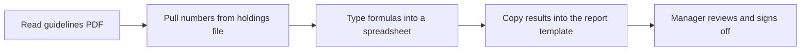
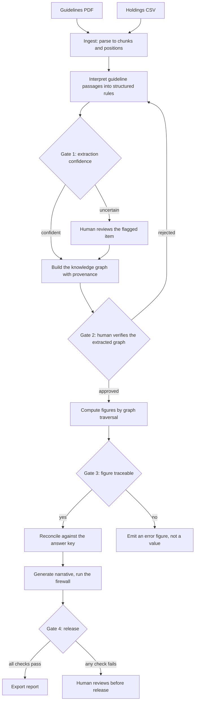

# Process Flows and Audit Event Catalogue

This document describes how the reporting process works today, how the system changes it, where a
human stays in the loop, the exact boundary between deterministic calculation and language-model text,
and the events the system records so an examiner can reconstruct any run.

## The process today (as-is)

A reporting analyst does the whole job by hand.

Every step is manual and undocumented. There is no record of where a figure came from, the formulas
live inside spreadsheet cells, transcription errors are easy to make, two runs rarely match exactly,
and a second firm's conventions mean redoing the spreadsheet. When an examiner asks where a number
came from, the answer is hard to produce.

## The process with the system (to-be)

Boxes are automated unless marked as a gate, where a human makes a decision. The gates are described
below.

Throughout, every stage writes to the append-only audit log.

## The gates and their criteria

| Gate | Where | Decision | Criterion for passing automatically | If it does not pass |
|------|-------|----------|--------------------------------------|---------------------|
| Gate 1 | After a passage is interpreted into a rule, before it enters the graph | Trust this extracted item | Extraction confidence is at or above the threshold (default 0.85), the item validates against the rule schema, and the calculation method it names is on the registry allow-list | The item is held for human review and does not enter the trusted graph until approved |
| Gate 2 | After the graph is built, before any figure is computed | Is the extracted graph correct | This gate is a deliberate human sign-off, because entity and relationship extraction is error-prone and the whole report depends on the graph being right. It auto-passes only in a demonstration mode where the graph matches a previously approved one | A reviewer edits or rejects the graph; nothing downstream runs until it is approved |
| Gate 3 | While computing each figure | Is this figure traceable | The figure resolves all the way along figure to graph path to source chunk, the contributing positions resolve, and a registered calculator produced the value | The figure is emitted with an error status and the reason, never as a silent value |
| Gate 4 | Before releasing the report | Release it | Reconciliation passes for every figure, the firewall passes, and every figure is traceable | The report is held for human review; nothing auto-releases with an unreconciled or untraceable figure |

The confidence threshold of 0.85 is a conservative default. A clean extraction of a well-structured
table passes automatically, while an ambiguous passage is flagged for a person rather than trusted
silently. The threshold is configurable.

Two failure modes are handled deliberately. An item the system cannot confidently interpret stops at
Gate 1 and never enters the graph silently. A figure that cannot be traced stops at Gate 3 and is
returned as an error. These are surfaced, not hidden.

## The boundary between the model and the deterministic engine

This boundary is the heart of the no-model-numbers requirement. It is stated per data item rather
than as a general intention.

| Concern | The model may | The model may not | How this is enforced |
|---------|---------------|-------------------|----------------------|
| Guideline text | Read a passage and propose a structured rule: its type, the entities involved, the threshold read from the text, and the name of a calculation method | Invent a calculation method that is not registered, or produce a figure | The method name is checked against a fixed list; an unknown one is rejected at Gate 1 |
| Holdings data | Nothing; it never receives the holdings | Read, sum, or reference any market value | The model client has no dependency on the holdings or the calculation code; no such code path exists |
| Figures | Nothing | Produce, round, reformat, or change any number | Only registered calculators write a figure's value, using exact decimal arithmetic |
| Narrative | Write prose that refers to figures already computed | Introduce any number not already in the computed output | After generation, a firewall scans the narrative and fails the run on any number not present in the computed figures |

In one sentence: every reported number is produced by a registered deterministic calculator from the
holdings and the graph-resolved rules; the model only interprets policy text into graph structure and
writes commentary, and a firewall proves the commentary added no number of its own.

## Audit event catalogue

The audit log is append-only. Once written, a record is never updated or deleted. Each event is one
JSON line in a per-run file. Retention below mirrors the fund guidelines (seven years for transaction
data, ten years for investor-facing reports, permanent for configuration changes).

| Event | Trigger | Data captured | Retention |
|-------|---------|---------------|-----------|
| Run started | A report run begins | Run id, firm, start time | 7 years |
| Configuration changed | A firm configuration is selected | Firm id and its three method settings | Permanent |
| Graph constructed | The graph build finishes | Node count, edge count, chunk count, position count | 7 years |
| Figures computed | All figures are calculated | Figure count | 7 years |
| Reconciled | Reconciliation against the answer key runs | Firm, figures passed, total, whether all passed | 10 years |
| Traceability checked | The traceability check runs | Figures passed, total, whether all passed | 7 years |
| Firewall checked | The narrative firewall runs | Count of numbers in the narrative, any violations, pass or fail | 10 years |
| Report exported | The report is written out | Output path | 10 years |

The current build records these eight events for every run. The catalogue extends naturally to finer
events (for example one record per figure, or per extracted entity with its confidence) using the same
append-only mechanism.

Append-only is demonstrated in code, not by policy. The audit writer exposes only an append operation
and a read operation, with no update or delete, and the underlying file is opened in append mode, so
no record can be rewritten once written.
