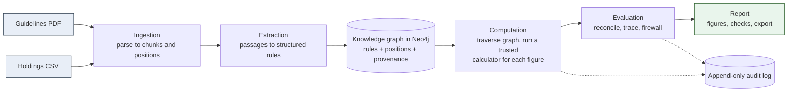
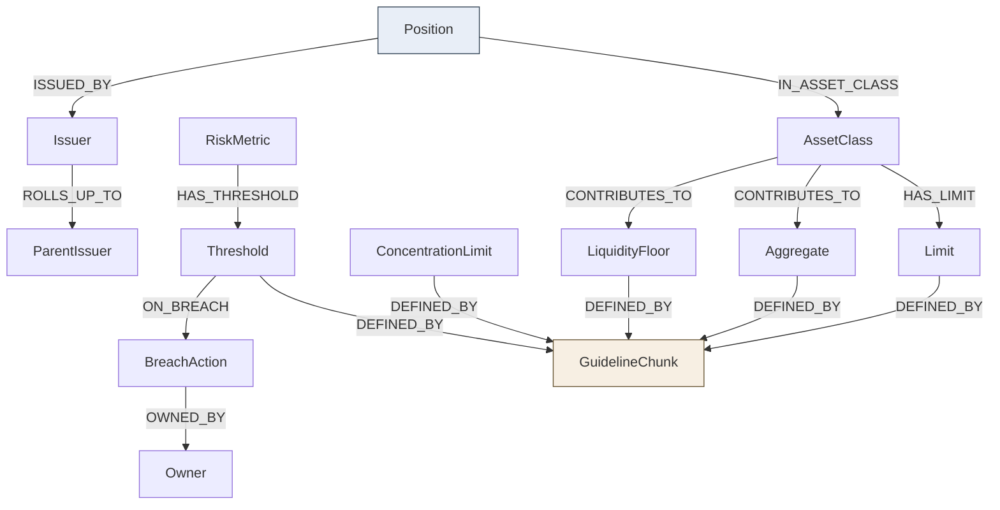
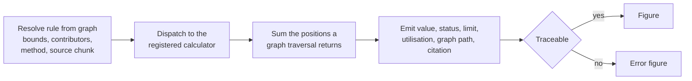

# Architecture

This document describes the components of the system, how data flows through them, the knowledge
graph model, and the way figures are computed. The reasoning behind the choices is in
[03_rfc.md](03_rfc.md).

## Component overview

The engine is a pipeline of separated layers. Data flows one way, and the language model sits outside
the path that produces numbers.

### Modules and their responsibilities

| Module | Owns | Does not |
|--------|------|----------|
| ingestion | Read the PDF and CSV into domain records | Compute figures |
| graph.extraction | Turn guideline chunks into structured rules | Receive holdings, or produce a figure |
| graph | Build the graph with provenance, run traversal queries | Hold business formulas |
| computation | Resolve rules from the graph and compute figures | Call the model, or read raw document text |
| firmconfig | Load a firm's conventions from YAML | Contain firm logic as separate code branches |
| reconciliation | Compare figures to the answer key | Change figures |
| evaluation | Verify traceability | Change figures |
| narrative | Generate commentary and run the firewall | Let a new number through |
| audit | Append immutable events | Expose update or delete |
| cli | Provide the command-line entry points | Contain business logic |

The boundaries are deliberately strict, because the requirements depend on them. The no-model-numbers
property holds because the model module and the computation module are wired apart.

## Data stores

Two stores are used for two jobs.

- Neo4j holds the knowledge: rules, positions, the relationships between them, and the provenance of
  every node and edge. Traceability is a graph traversal problem, so the rules and positions live in a
  graph.
- An append-only audit log holds the immutable record of each run. In this build it is a per-run JSONL
  file written in append mode; in production the same append-only interface would sit in front of an
  immutable database collection with the events hash-chained for tamper evidence.

## The knowledge graph model

A single graph holds both the rules and the positions, so a figure can be traced from the portfolio
data, through the rule that governs it, to the passage that defines the rule.

Every node and every edge carries provenance: source document, page where applicable, chunk
identifier, ingestion time, and an extraction confidence. Guideline chunks are produced at line level,
so each rule cites a tight passage. Every limit, cap, floor, and threshold ends at the guideline chunk
that defines it, which is where a figure's citation points.

The graph answers multi-hop questions by traversal. For example, the breach action and owner for the
duration limit is found by walking RiskMetric to Threshold to BreachAction to Owner, without
re-reading the document.

## How a figure is computed

1. The rule resolver reads every rule from the graph: its bounds, its contributing asset classes, the
   calculation method, and the source chunk it is defined by.
2. The computation service dispatches each rule to the trusted calculator registered for its method.
3. The calculator sums the contributing positions returned by a graph traversal, compares the result
   to the limit, and produces the value, status, limit, utilisation, graph path, and citation.
4. A rule that cannot be traced to a source chunk yields an error figure rather than a value.

The set of calculation methods is a fixed allow-list. The graph stores a method name; the engine owns
the implementation. A name with no registered calculator is rejected, never executed.

## Firm configuration

A firm is a small YAML file describing three settings: whether below-investment-grade holdings count
toward the non-investment-grade aggregate, whether concentration is measured per issuer or per parent
group, and how utilisation is formatted. The shared calculators read these settings at run time.
Selecting a firm loads its file; the engine code does not change between firms.

## Runtime

A local Neo4j instance is started with Docker. The engine is a single runnable jar with two commands,
ingest and report, the latter taking a firm selector. Computed figures are exported as JSON, and each
run produces an append-only audit log. A separate web view reads the exported run artifacts to present
the figures, their traceability, the reconciliation, and the audit trail.
